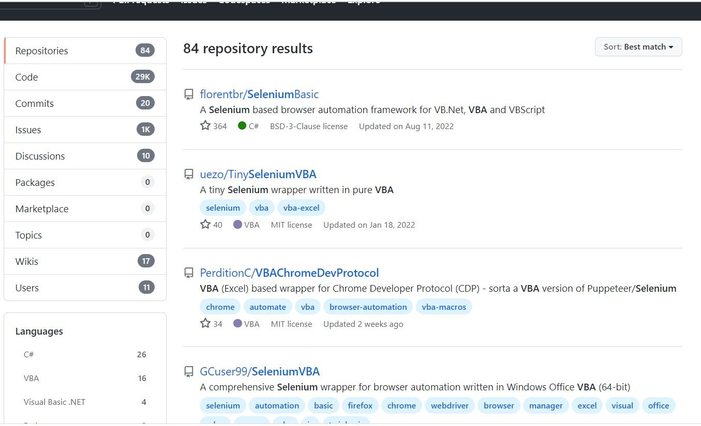
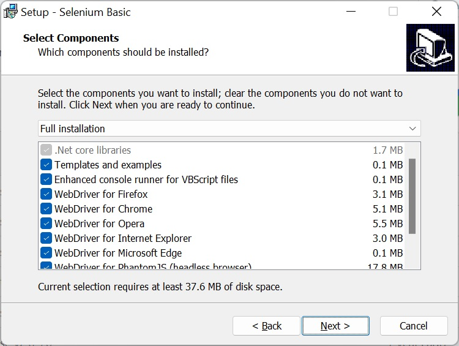
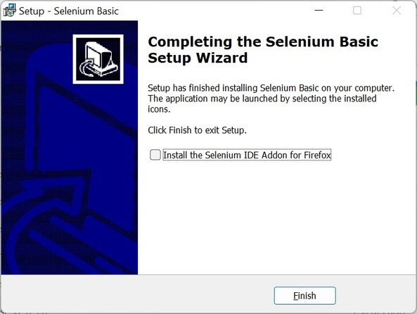

## Web Scraping Concepts  

### Overview (possible solutions)
VBA provides inbuilt libraries to automate Internet explorer. Since IE is now deprecated, there is a need for solution(s) that work for chrome, firefox and other browsers.

**Selenium** has been leading in this area since many years and therefore many libraries/wrappers have been developed for VBA.

A quick search over github shows many such solutions:

In this course, we will primarily talk about florentbr/SeleniumBasic.

##### SeleniumBasic is a Selenium based browser automation framework for VB.Net, VBA and VBScript. 

You can follow the steps below to automate Edge browser with SeleniumBasic:
- Download the latest version of [SeleniumBasic v2](https://github.com/florentbr/SeleniumBasic/releases/tag/v2.0.9.0).

- Install

- This will install all required drivers and templates. You can choose if you want to install drivers only for specific browsers. There is no need to install all. However if you are unsure, you can go with default installation.

- Then you can select if you want to install firefox IDE plugin. This plugin is useful to record the actions/steps and later those can be used as it is. Again, this is also optional.

