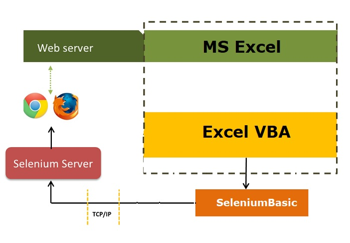
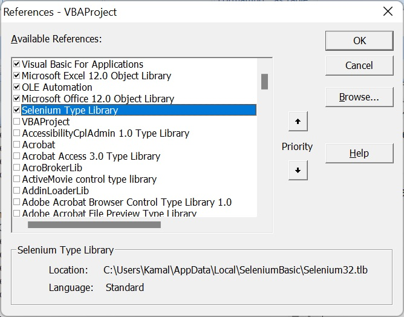

# Web Scraping Concepts

### Overview (possible solutions)

VBA provides inbuilt libraries to automate Internet explorer. Since IE is now deprecated, there is a need for solution(s) that work for chrome, firefox and other browsers.

**Selenium** has been leading in this area since many years and therefore many libraries/wrappers have been developed for VBA.

A quick search over github shows many such solutions:


In this course, we will primarily talk about florentbr/SeleniumBasic.

##### SeleniumBasic is a Selenium based browser automation framework for VB.Net, VBA and VBScript.

### Setup / Installation - SeleniumBasic

- Download the latest version of [SeleniumBasic v2](https://github.com/florentbr/SeleniumBasic/releases/).

- Install

- This will install all required drivers and templates. You can choose if you want to install drivers only for specific browsers. There is no need to install all. However if you are unsure, you can go with default installation.
  

- Then you can select if you want to install firefox IDE plugin. This plugin is useful to record the actions/steps and later those can be used as it is. Again, this is also optional.


### Selenium Overview

**Selenium** is a tool that can be used to automate web browsers, and its usage is not restricted to testing web applications. Once you have this capability, the manner in which you put it to use is entirely left to your discretion. While the primary function of Selenium is to automate web applications for testing, it has many other potential applications as well.

To learn more about selenium, refer [selenium official website](https://www.seleniumhq.org/)

SeleniumLibrary is a web testing library for Robot Framework that utilizes the Selenium tool internally.




If we deep diver further, we also need to understand the role of browser drivers. Basically, our code do not directly communicate with browsers. These browser communities also provide us browser drivers (eg. chromedriver, geckodriver, edgedriver)

Selenium communicates with browser drivers using a language-specific client library (e.g. Python, Java, C#, VB) that sends commands to the browser driver through a defined protocol such as the WebDriver protocol. The browser driver then translates these commands into actions that can be understood by the browser, such as clicking a button or entering text into a form field.

```
       +-------------------+                      +----------------------+
       |   Selenium        |                      |   Web Browser        |
       |   Client Library  |                      |                      |
       +-------------------+                      +----------------------+
                  |                                          |
                  |                                          |
                  v                                          v
       +-------------------+                      +----------------------+
       |   Browser Driver  |  <--- WebDriver Protocol --- |  Automation Interface|
       |                   |  --- Browser-Specific Protocol -->                 |
       +-------------------+                      +----------------------+

```

In this diagram, the Selenium client library sends commands to the browser driver using the WebDriver protocol. The browser driver translates these commands into browser-specific actions using the browser's automation interface, which controls and interacts with the browser itself. The browser then executes these actions and sends back any relevant information to the browser driver, which passes it back to the Selenium client library.


### Selenium Type Library

To use FlorentBR/seleniumLibray in VBA, you need to import **Selenium Type Library**. To do this, you need to

- Open VBA editor
- Go to Tools > References.
- Scroll down to look for **Selenium Type Library**.
- Select and click OK.



- Well, that's not enough. You must also ensure that the browser driver you download is compatible with the version of the browser that is installed on your system. You can go to these links to download browser drivers:

[Chromedrivers](https://chromedriver.chromium.org/downloads)
[Firefox Geckodriver](https://github.com/mozilla/geckodriver/releases)
[Edge Driver](https://developer.microsoft.com/en-us/microsoft-edge/tools/webdriver/)

After downloading, you need to place it inside "C:\Users\<YOUR_USERNAME>\AppData\Local\SeleniumBasic". Now we are good to write some code.


### Code to Open and Close a Browser
```
Sub OpenChrome()
  Dim driver As New ChromeDriver
  driver.Get "https://www.extremeExcel.com"
  driver.Quit
End Sub


Private Sub OpenFirefox()
  Dim driver As New FirefoxDriver
  driver.Get "https://www.extremeExcel.com"
  driver.Quit
End Sub


Private Sub OpenEdge()
  Dim driver As New EdgeDriver
  driver.Get "https://www.extremeExcel.com"
  driver.Quit
End Sub

```

### Basic Identification techniques

Selenium is a popular testing tool for automating web applications, and one of its key features is its ability to identify and interact with web elements on a page. There are several techniques that can be used to identify web elements using Selenium:

- **By ID:** The most reliable and preferred method of identifying web elements is by using their unique ID attribute. An element's ID is a unique identifier assigned to it in the HTML code, and it can be used to locate the element in the page.

```
Dim driver As New WebDriver
driver.Start "chrome"
driver.Get "https://www.example.com"
Dim element As WebElement
Set element = driver.FindElementById("myElementID")

```


- **By Name:** Elements can also be identified using their name attribute. This method is useful when there are multiple elements on a page with the same ID.

```
Dim driver As New WebDriver
driver.Start "chrome"
driver.Get "https://www.example.com"
Dim element As WebElement
Set element = driver.FindElementByName("myElementName")
```

- **By Class Name:** Elements can be identified using their class attribute. This method is useful when there are multiple elements on a page with the same name or ID.

```
Dim driver As New WebDriver
driver.Start "chrome"
driver.Get "https://www.example.com"
Dim element As WebElement
Set element = driver.FindElementByClassName("myElementClass")
```

- **By Tag Name:** Elements can be identified using their HTML tag name, such as div, p, or input. This method is useful when you want to locate all elements of a certain type on a page.

```
Dim driver As New WebDriver
driver.Start "chrome"
driver.Get "https://www.example.com"
Dim elements As WebElements
Set elements = driver.FindElementsByTag("input")
```

- **By Link Text:** Elements such as links can be identified using their exact link text. This method is useful for locating links that have unique text content.

```
Dim driver As New WebDriver
driver.Start "chrome"
driver.Get "https://www.example.com"
Dim element As WebElement
Set element = driver.FindElementByLinkText("Click here")
```

- **By Partial Link Text:** This method is similar to identifying elements by link text, but it matches elements that contain the specified text as part of their link text. This can be useful when the link text is too long or changes dynamically.

```
Dim driver As New WebDriver
driver.Start "chrome"
driver.Get "https://www.example.com"
Dim element As WebElement
Set element = driver.FindElementByPartialLinkText("Click")
```

- **By CSS Selector:** CSS selectors can be used to identify elements based on their location or relationship to other elements on the page. For example, you could identify an element based on its parent element, its sibling element, or its position on the page.

```
Dim driver As New WebDriver
driver.Start "chrome"
driver.Get "https://www.example.com"
Dim element As WebElement
Set element = driver.FindElementByCss("input[type='submit']")
```

- **By XPath:** XPath is a language for selecting nodes in an XML document, and it can also be used to identify elements on a web page. XPath expressions can be used to locate elements based on their tag name, attributes, text content, and more.

```
Dim driver As New WebDriver
driver.Start "chrome"
driver.Get "https://www.example.com"
Dim element As WebElement
Set element = driver.FindElementByXPath("//input[@id='myInput']")
```

When using these identification techniques in Selenium, it is important to choose the most appropriate one for the specific element you are trying to locate. If an element has a unique ID, it is usually best to use that method. However, if there are multiple elements with the same ID, you may need to use a different technique, such as class name or CSS selector. By choosing the most appropriate identification technique, you can ensure that your Selenium tests are reliable and accurate.